

# SE-Assignment-6
 Assignment: Introduction to Python
Instructions:
Answer the following questions based on your understanding of Python programming. Provide detailed explanations and examples where appropriate.

 Questions:

1. Python Basics:
   - What is Python, and what are some of its key features that make it popular among developers? Provide examples of use cases where Python is particularly effective.

   Python is a versatile, high-level programming language that emphasizes code readability and simplicity. It was created by Guido van Rossum. Python is an open-source language, meaning anyone can use or modify its codebase. 

Key Features of Python

   •	Readability: Python's syntax is designed to resemble everyday English, making it easy for developers to read, understand, and maintain code.
   •	Object-oriented: Python supports object-oriented programming, allowing developers to model real-world objects and encapsulate data and behavior.
   •	Interpreted: Python code is interpreted, not compiled, meaning it does not need to be converted into machine code before execution. This allows for faster development cycles.
   •	Dynamically-typed: Python uses dynamic typing, where variables do not have fixed types and are assigned types at runtime. This provides flexibility but can also lead to runtime errors.
   •	Extensible: Python has an extensive ecosystem of libraries and modules that extend its functionality for various domains, making it highly versatile.
   •	Cross-platform: Python code can run on multiple operating systems, including Windows, macOS, and Linux, without the need for platform-specific modifications.

Use Cases of Python

Python is widely used in various domains due to its ease of use, versatility, and extensive library support. These include:
   •	Web Development: Django and Flask are popular Python frameworks used for building web applications.
   •	Data Science: Python libraries like NumPy, Pandas, and SciPy provide powerful tools for data analysis, machine learning, and artificial intelligence.
   •	Automation: Python's simplicity and flexibility make it ideal for automating tasks, such as web scraping, testing, and scheduling.

2. Installing Python:
   - Describe the steps to install Python on your operating system (Windows, macOS, or Linux). Include how to verify the installation and set up a virtual environment.

   Steps to Install Python on Windows:

   1.	Download the Python Installer:
•	Visit the official Python website (https://www.python.org/downloads/) and choose the latest stable version for Windows.

   2.	Run the Installer:

   •	Double-click on the downloaded executable file and follow the on-screen instructions.
   •	Select "Install Now" and ensure to check the option to add Python to the Windows path.
   3.	Verification:

   •	Open the Command Prompt or PowerShell and type:
      •	python --version
      •	This should display the installed Python version.
      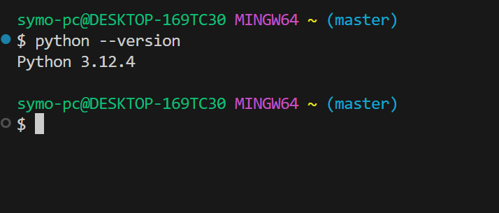

3. Python Syntax and Semantics:

   - Write a simple Python program that prints "Hello, World!" to the console. Explain the basic syntax elements used in the program.

   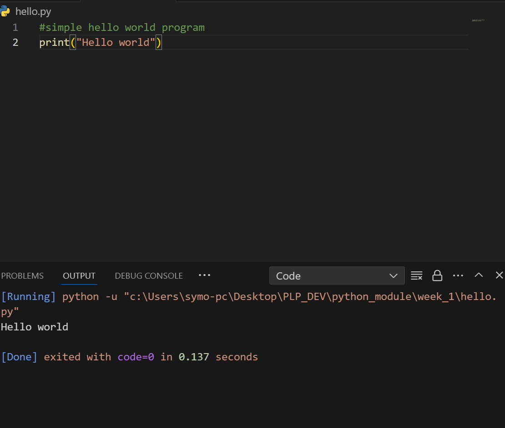
   Comments: Comments are used to add explanations or notes to your code. They are ignored by the Python interpreter. Comments start with the # symbol
Print statements: Print statements are used to print data to the console
Print()
Strings: Strings are sequences of characters. Strings are enclosed in single (') or double (") quotes.

4. Data Types and Variables:

   - List and describe the basic data types in Python. Write a short script that demonstrates how to create and use variables of different data types.

   Basic Data Types in Python:

   •	Integers (int): Whole numbers without decimal points.
   •	Float: Numbers with decimal points.
   •	Strings (str): Sequences of characters enclosed in single or double quotes.
   •	Boolean (bool): True or False values.
   •	Tuples (tuple): Immutable ordered collections of elements.

   Input
   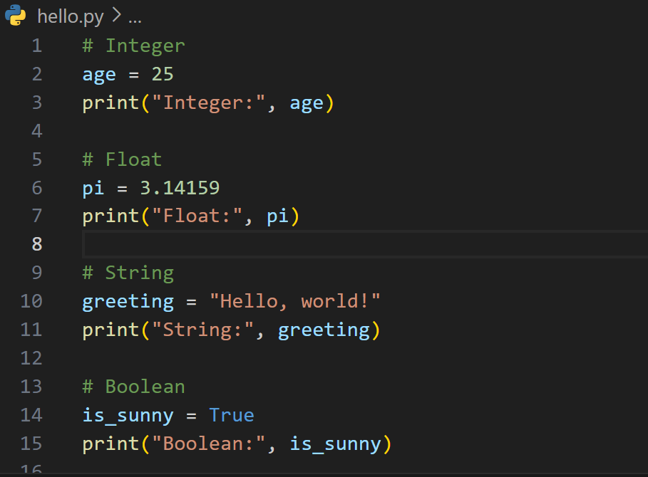

   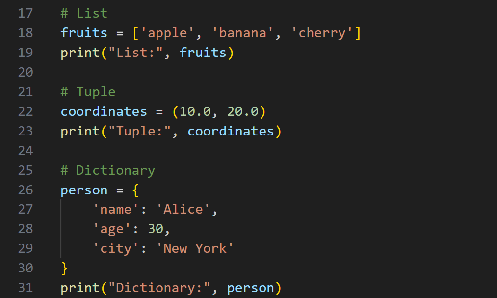

   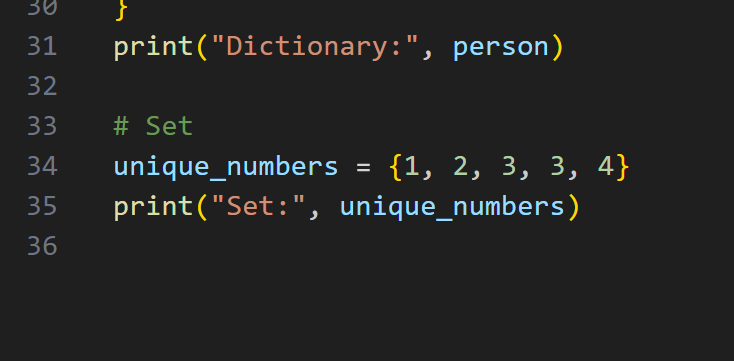

   Output
   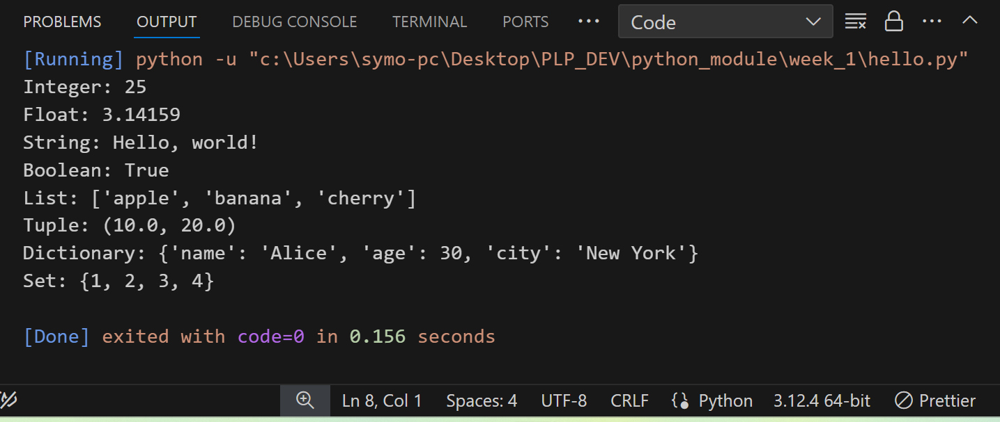

5. Control Structures:

   - Explain the use of conditional statements and loops in Python. Provide examples of an `if-else` statement and a `for` loop.

   Conditional Statements.

Conditional statements allow you to control the flow of your program based on specific conditions. The most common conditional statement is the
if-else Statement

if condition:

    # code to be executed if condition is True
else:
    # code to be executed if condition is False
Example:
number = 10
if number > 0:
    print("Number is positive")
else:
    print("Number is non-positive")
Output:
Number is positive

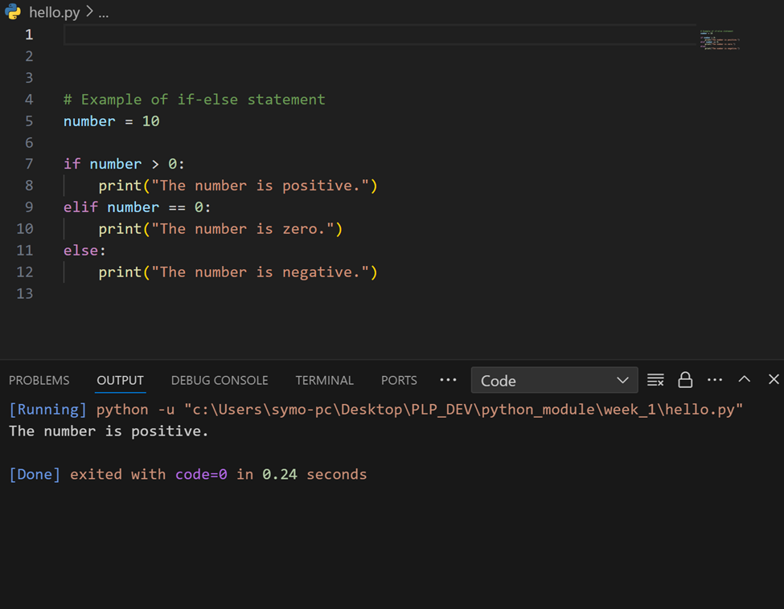

Loops
Loops allow you to iterate over a collection of items.  
for Loop
for item in collection:
    # code to be executed for each item in collection
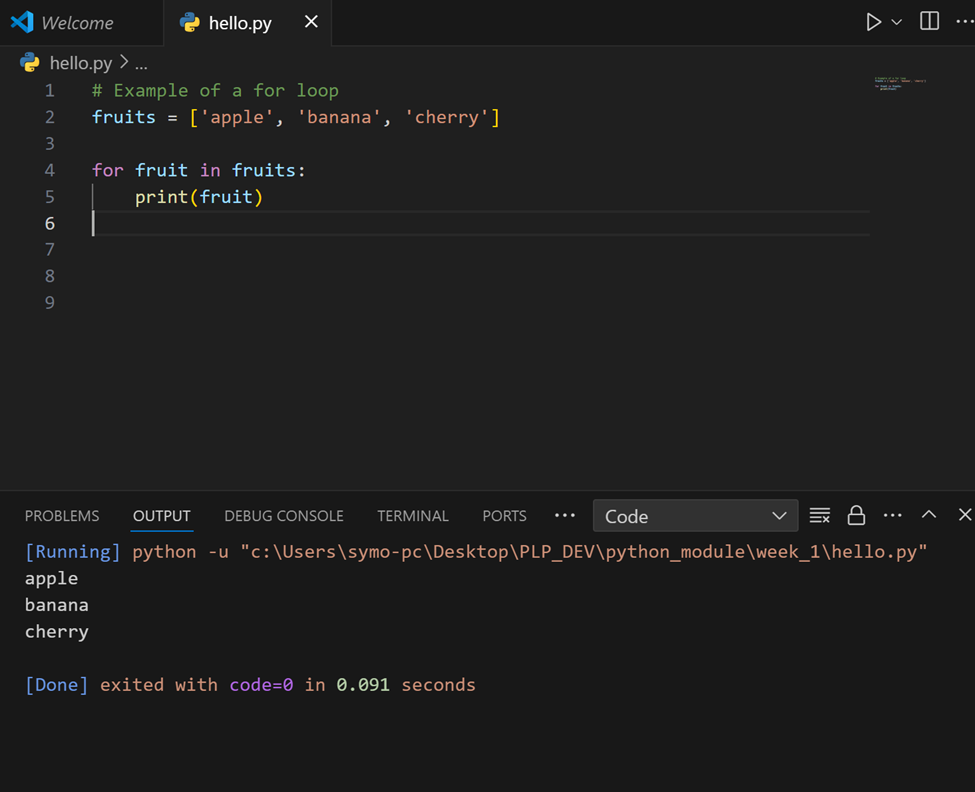

6. Functions in Python:

   - What are functions in Python, and why are they useful? Write a Python function that takes two arguments and returns their sum. Include an example of how to call this function.

   Functions in Python are blocks of reusable code that perform a specific task. They allow you to organize your code into manageable sections, make it more readable, and reduce redundancy by enabling code reuse.

   Function to Return the Sum of Two Arguments.

   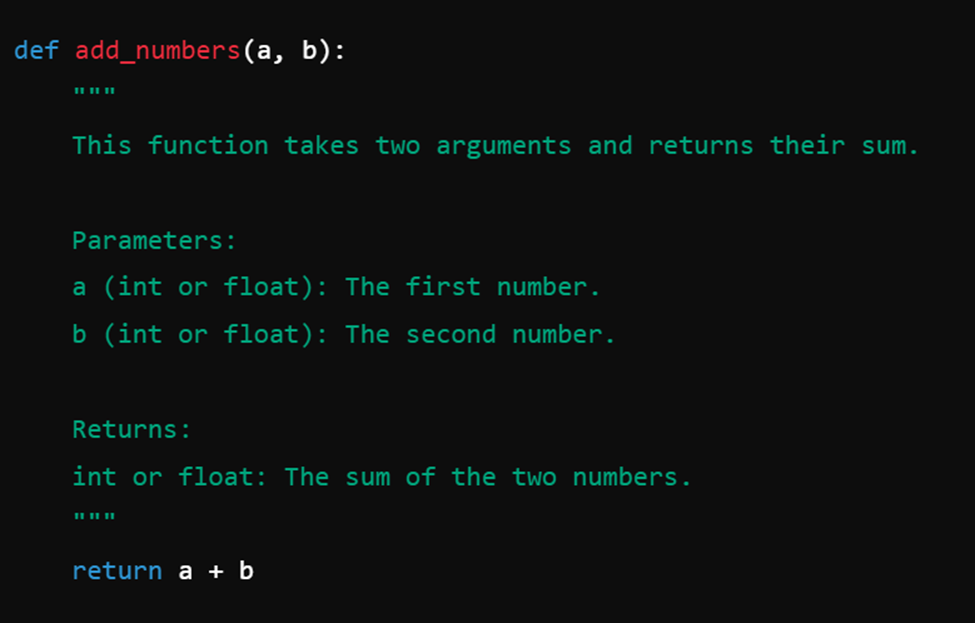

   How to Call the Function
   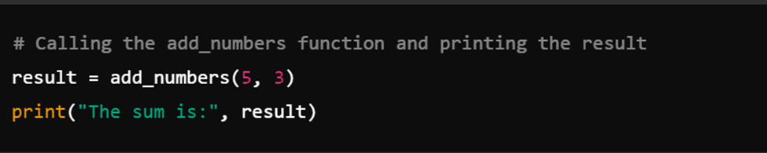
   

7. Lists and Dictionaries:

   - Describe the differences between lists and dictionaries in Python. Write a script that creates a list of numbers and a dictionary with some key-value pairs, then demonstrates basic operations on both.
   Differences Between Lists and Dictionaries in Python
Lists:

   •	Ordered: The elements in a list are stored in a specific order.
   •	Indexed: Elements are accessed by their index, which starts at 0.
   •	Mutable: You can change the elements in a list after it has been created.
   •	Allows Duplicates: Lists can contain duplicate elements.
   •	Syntax: Lists are created using square brackets.

Dictionaries:

   •	Unordered: The elements (key-value pairs) in a dictionary are not stored in a specific order.
   •	Key-Value Pairs: Each element in a dictionary is a pair consisting of a key and a value.
   •	Keys Must Be Unique: Each key in a dictionary must be unique, but values can be duplicated.
   •	Mutable: You can change the key-value pairs in a dictionary after it has been created.
   •	Syntax: Dictionaries are created using curly braces {} with a colon : separating keys and values.

Python Script
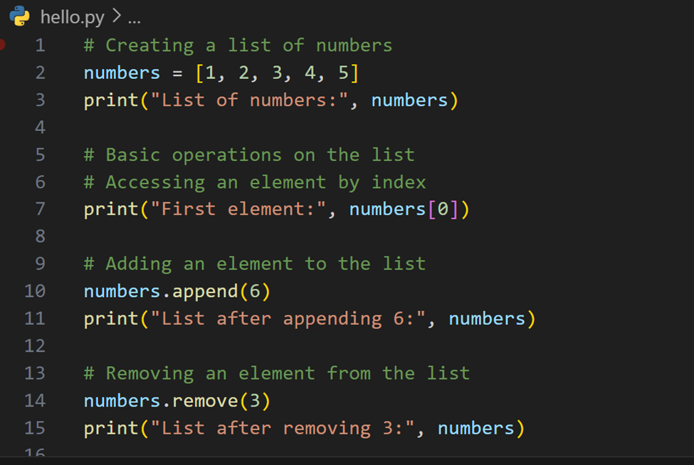

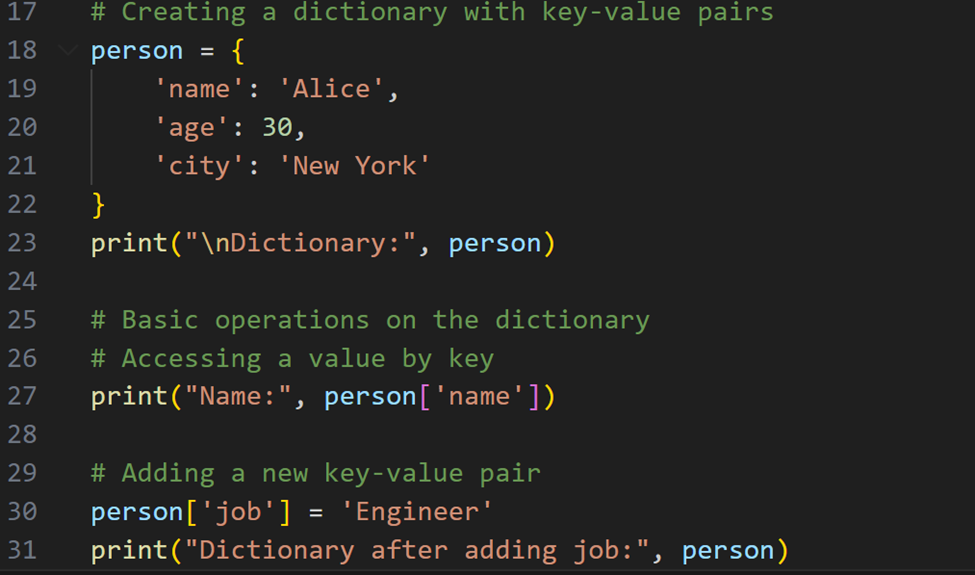

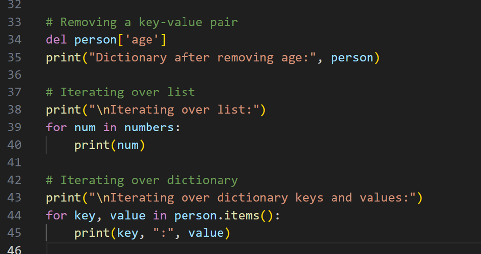

Output 
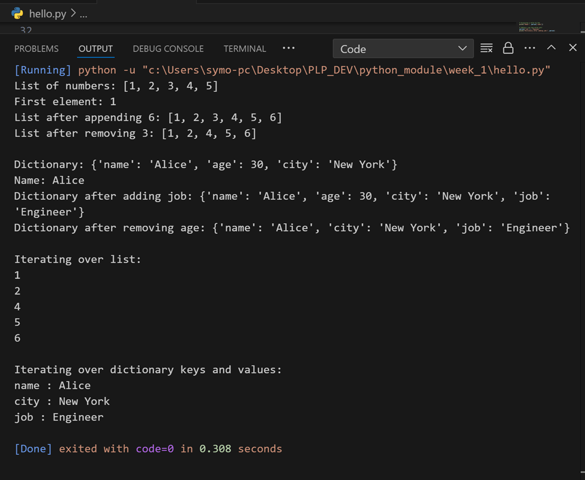

8. Exception Handling:

   - What is exception handling in Python? Provide an example of how to use `try`, `except`, and `finally` blocks to handle errors in a Python script.

   Exception Handling in Python

Exception handling in Python is a mechanism that allows you to handle runtime errors gracefully. 
Exception handling in Python allows you to handle errors and exceptions that occur during execution and prevent your code from crashing. Errors are conditions that make the code unable to continue execution, while exceptions are objects representing specific errors.

Key Components:

   •	try: The block of code to be tested for errors while it is being executed.
   •	except: The block of code to be executed if an error occurs in the try block.
   •	finally: The block of code that will be executed regardless of whether an exception was raised or not. This is typically used for cleanup actions, such as closing files or releasing resources.

   USE EXAMPLE.
   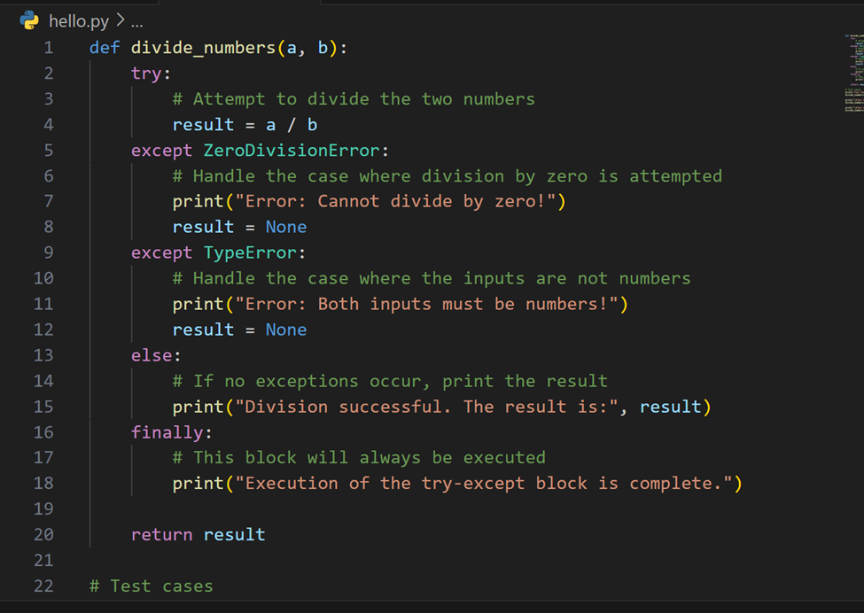

   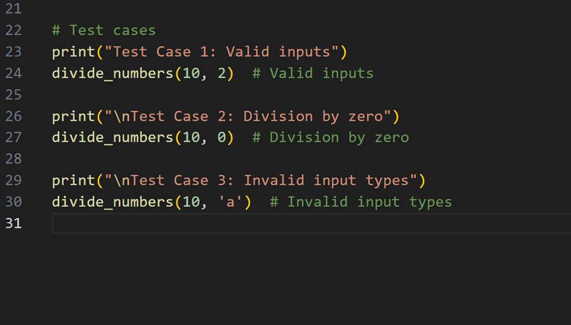

   OUTPUT 
   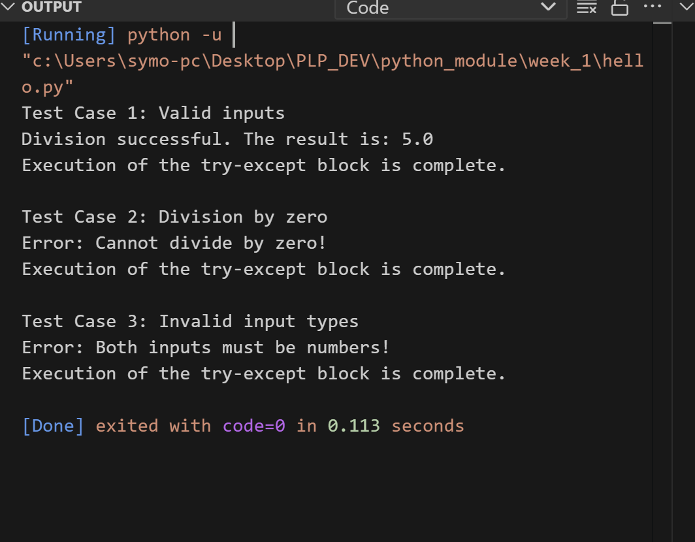

9. Modules and Packages:

   - Explain the concepts of modules and packages in Python. How can you import and use a module in your script? Provide an example using the `math` module.

 Module: A Python module is a file containing Python code (functions, classes, variables) that can be imported and used by other Python scripts.

Package: A package is a collection of related modules organized in a hierarchical file structure. Packages are used to group modules related to a specific functionality or topic.

Importing and Using a Module:

To import a module, use the
   import
statement followed by the module's name. For example:
   import math
This statement imports the math module into your script. You can now access its functions and variables using the module name as a namespace.

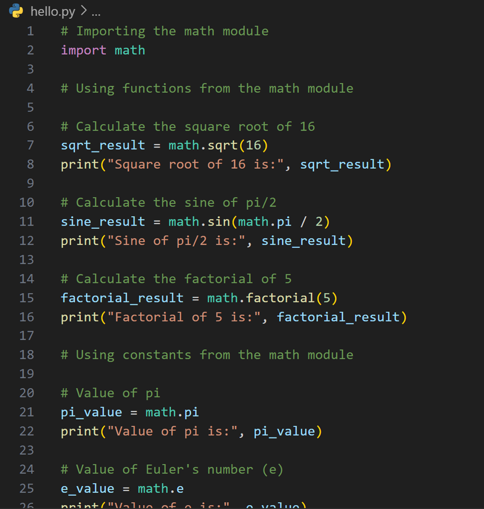

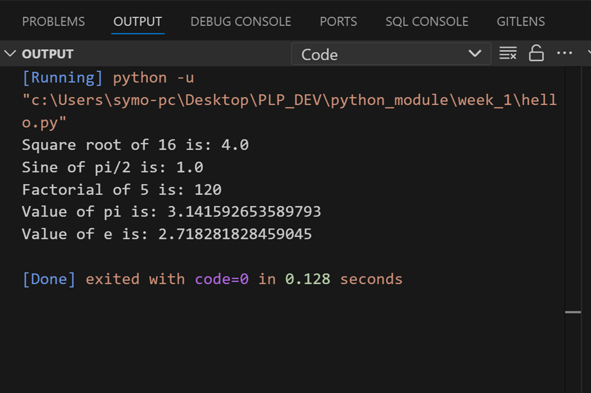

10. File I/O:

    - How do you read from and write to files in Python? Write a script that reads the content of a file and prints it to the console, and another script that writes a list of strings to a file.

    Reading from and Writing to Files in Python

In Python, you can use the built-in open() function to read from and write to files. The open() function returns a file object, which provides methods and attributes to interact with the file.
Reading from a File
To read from a file, you open it in read mode ('r') and use methods like read(), readline(), or readlines() to read the file's content.

Example Script to Read from a File

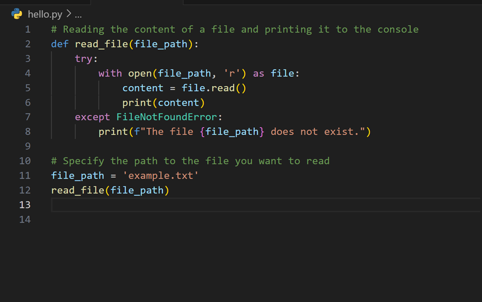

Writing to a File
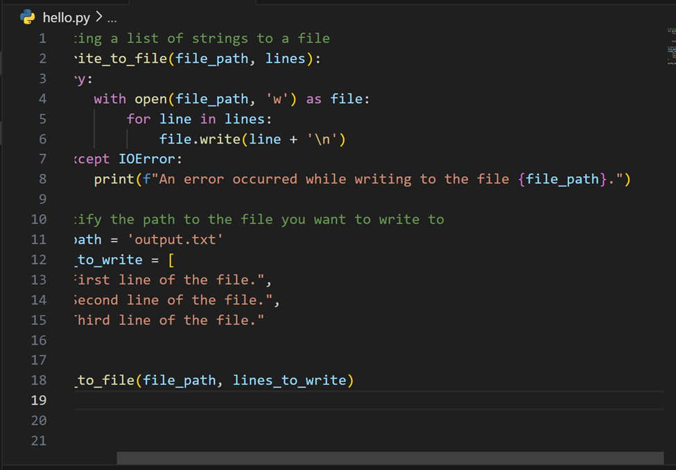

# Submission Guidelines:
- Your answers should be well-structured, concise, and to the point.
- Provide code snippets or complete scripts where applicable.
- Cite any references or sources you use in your answers.
- Submit your completed assignment by [due date].

